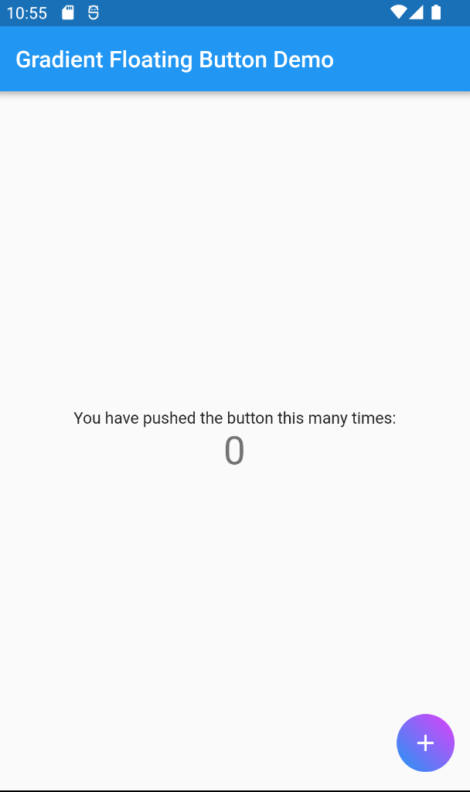
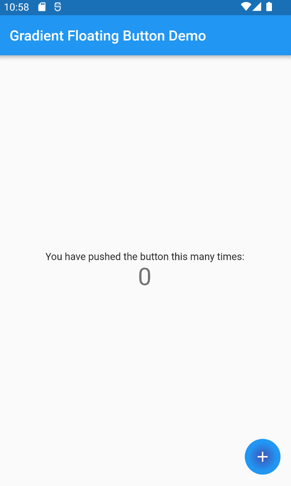

<!-- 
This README describes the package. If you publish this package to pub.dev,
this README's contents appear on the landing page for your package.

For information about how to write a good package README, see the guide for
[writing package pages](https://dart.dev/guides/libraries/writing-package-pages). 

For general information about developing packages, see the Dart guide for
[creating packages](https://dart.dev/guides/libraries/create-library-packages)
and the Flutter guide for
[developing packages and plugins](https://flutter.dev/developing-packages). 
-->

This package allows you to easily create FABs (Floating Action Buttons) with linear & radial gradient background.

## Features
> Create FABs with gradient backgrounds using Linear Gradient & Radial Gradient

## Screenshots





## Getting Started

Add this dependency to your **pubspec.yaml** file.

```
gradient_floating_button: ^0.0.2
//Add dependency from pub.dev to get latest version.
```

## Usage

```
// Use the 'GradientFloatingButton().withLinearGradient()' for Linear Gradient Background
floatingActionButton: GradientFloatingButton().withLinearGradient(
          onTap: _incrementCounter,
          iconWidget: const Icon(
            Icons.add,
            color: Colors.white,
          ),
          alignmentEnd: Alignment.topRight,
          alignmentBegin: Alignment.bottomLeft,
          colors: [Colors.blue, Colors.purpleAccent]),
```

You can refer complete example from the `/example` folder.

### Having Issues

File the Issue [here](https://github.com/7span/gradient-floating-button-flutter/issues)

### Looking to contribute to this package:

**🤘🏻 Great!**
Fork the [Repo](https://github.com/7span/gradient-floating-button-flutter), Update Code, Send a PR. That's all you need to Contribute.


